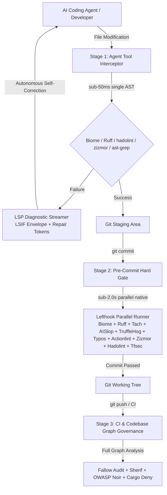

# @heretek-ai/agent-proof 🔒

> **Zero-Bloat Mechanical Hard-Gate for Autonomous AI Coding Agents** — Deterministic multi-tier code governance, sub-50ms post-edit interceptors, sub-2.0s pre-commit gates, strict suppression hygiene, and LSP diagnostic envelopes with repair tokens for Claude Code, Antigravity, Cursor, Codex, and Aider.

[](https://www.npmjs.com/package/@heretek-ai/agent-proof)
[](https://github.com/Heretek-AI/Agent-Proof/actions/workflows/ci.yml)
[](https://github.com/Heretek-AI/Agent-Proof/actions/workflows/e2e-drop.yml)
[](https://github.com/Heretek-AI/Agent-Proof/actions/workflows/publish.yml)
[](https://docs.npmjs.com/trusted-publishers)
[](LICENSE)
[](package.json)
[](package.json)

---

## 🎯 Executive Overview

Prompt-based guardrails (`CLAUDE.md`, `.cursorrules`, `rules.md`, system prompts) inevitably degrade under context saturation and complex multi-file refactoring tasks. When autonomous AI coding agents make rapid edits, they frequently introduce **AI Slop**:
- **Swallowed Errors & Empty Catch Blocks**: `try { ... } catch (e) {}` that mask outages.
- **Strict Suppression Bypass**: Blindly inserting `// @ts-ignore`, `// biome-ignore`, or `# noqa` to bypass checks without fixing underlying bugs.
- **Unsafe Type Casting**: Pervasive `as any` or unchecked type assertions that erode type safety.
- **Hallucinated Dependencies**: Imports from packages not declared in `package.json` or `pyproject.toml`.
- **Architectural Drift & Circular Imports**: Breaking modular isolation boundaries and leaking domain abstractions.
- **Governance Tampering**: Agents weakening or modifying linter configs (`biome.json`, `ruff.toml`, `lefthook.yml`) to pass commits.

**Agent-Proof** replaces soft prompt instructions with **deterministic, zero-bloat mechanical hard gates**: standalone compiled native binaries (Rust, Go) and lifecycle interceptors that physically prevent non-compliant code from reaching version control.

---

## ⚡ The Zero-Bloat Compiled Native Engine Philosophy

Traditional verification frameworks rely on heavy interpreted runtimes (Python venvs, JVMs, Ruby VMs, deep Node.js trees) that introduce 1.2s – 4.0s of startup latency. Agent-Proof strictly enforces **compiled, standalone native binaries** executing in single-digit to low double-digit milliseconds:

| Candidate Tool | Target Ecosystem | Engine / Binary Language | Latency Profile | Architectural Verdict | Primary Justification |
| :--- | :--- | :--- | :--- | :--- | :--- |
| **ast-grep** | Polyglot (25+ Languages) | Rust (Tree-sitter Engine) | 5 ms – 20 ms | **Keeper (Stage 1 & 2)** | Ultra-fast structural AST search & pattern rewriting; zero runtime bloat. |
| **Biome** | JS / TS / JSON / CSS | Rust (Compiled Binary) | 5 ms – 25 ms | **Keeper (Stage 1 & 2)** | Sub-millisecond formatting and linting replacing ESLint + Prettier. |
| **Ruff** | Python | Rust (Compiled Binary) | 10 ms – 30 ms | **Keeper (Stage 1 & 2)** | Replaces Flake8, Isort, and Bandit with a 100x speedup. |
| **Tach** | Python Architecture | Rust (Compiled Binary) | 10 ms – 25 ms | **Keeper (Stage 1 & 2)** | Enforces modular import boundaries and prevents architectural drift. |
| **fallow** | JS / TS Graph Intelligence | Rust (Oxc Parser Engine) | 15 ms – 50 ms | **Keeper (Stage 3)** | Fast dead code, unused exports, circular imports, and complexity hotspots. |
| **zizmor** | GitHub Actions / CI | Rust (Compiled Binary) | 15 ms – 40 ms | **Keeper (Stage 1 & 2)** | Workflow security audit: expression injection, unpinned action SHAs. |
| **hadolint** | Docker / Containers | Haskell / Rust Binary | 10 ms – 30 ms | **Keeper (Stage 1 & 2)** | Standalone Dockerfile static analysis and root user detection. |
| **tfsec** | Terraform / IaC | Go (Compiled Binary) | 30 ms – 80 ms | **Keeper (Stage 1 & 2)** | Static cloud security misconfiguration scanner. |
| **kube-score** | Kubernetes YAML | Go (Compiled Binary) | 15 ms – 45 ms | **Keeper (Stage 1 & 2)** | Security analysis of Kubernetes manifests and pod security contexts. |
| **gosec & revive** | Go | Go (Compiled Binary) | 20 ms – 80 ms | **Keeper (Stage 1 & 2)** | Static Go security scanning and idiomatic linting. |
| **cargo-deny** | Rust | Rust (Compiled Binary) | 20 ms – 60 ms | **Keeper (Stage 2 & 3)** | Dependency, license, and security advisory verification. |
| **ESLint / PMD / Bandit** | Polyglot | Node.js / JVM / PyEnv | 1,200 ms – 4,000 ms | **Culled / Misfits** | High process startup latency; violates sub-second agent pairing loop. |

---

## 🏗️ 3-Tier Execution Architecture



### Execution Stage SLA Matrix

| Stage | Trigger Event | Latency Target | Scope | Canonical Engines |
| :--- | :--- | :--- | :--- | :--- |
| **Stage 1: Pre-Tool / Edit** | `PostFileEdit` agent hook | `< 50ms` | Single modified file AST | Biome (`--write`), Ruff (`--fix`), Hadolint, Zizmor, SkillCheck |
| **Stage 2: Hard Git Gate** | `git commit` (Pre-Commit) | `< 2.0s` | Staged blobs (`--staged`) | Lefthook parallel: Biome, Ruff, Tach, AISlop, TruffleHog, Typos, Actionlint, Zizmor, Hadolint, Tfsec, Kube-Score, ast-grep |
| **Stage 3: CI & Graph Audit** | `git push` / PR Pipeline | Unconstrained | Full codebase graph | Fallow (dead exports / circular deps), Sherif (monorepos), OWASP Noir (API attack surface) |

---

## 🛡️ Strict Suppression Hygiene Gate

Agents frequently attempt to bypass mechanical gates by inserting blind suppression comments (`// @ts-ignore`, `// biome-ignore`, `# noqa`, `// eslint-disable`).

Agent-Proof's **Suppression Hygiene Gate** treats newly inserted unapproved suppression markers as blocking **Severity 1** violations:

```json
{
  "source": "aislop",
  "rule_id": "AI_SLOP_UNAUTHORIZED_SUPPRESSION",
  "severity": "ERROR",
  "file_path": "src/auth.ts",
  "error_message": "Unauthorized @ts-ignore suppression comment inserted to bypass type checking.",
  "repair_instruction": {
    "action": "REWRITE_BLOCK",
    "description": "Remove unauthorized suppression comment. Fix the underlying type or lint issue rather than bypassing governance.",
    "repair_tokens": [
      "// Remove suppression comment and fix root cause with type guards or explicit handling"
    ]
  }
}
```

---

## 🚀 Quick Start

Initialize mechanical hard gates in any repository with zero configuration:

```bash
# Zero-install execution via npx
npx @heretek-ai/agent-proof init

# Alternative compatibility aliases
npx create-agent-proof
npx create-agent-gate

# Or install as dev dependency
npm install -D @heretek-ai/agent-proof
npx agent-proof init
```

### CLI Command Reference

Both `agent-proof` and `agent-gate` binaries are fully supported:

```bash
# Inspect repository stack, emit configs, install git hooks, and lock permissions
agent-proof init [directory]

# Detect language stacks and agent harnesses without modifying filesystem
agent-proof detect [--json]

# Run mechanical gate stages directly
agent-proof run post-edit <filePath>   # Stage 1: PostFileEdit hook (< 50ms)
agent-proof run pre-commit            # Stage 2: Staged files hard gate (< 2.0s)
agent-proof run pre-push              # Stage 3: Full codebase graph audit

# Stream and format raw tool stderr into LSP Diagnostic Envelope
cat tool_output.log | agent-proof format-diagnostics --tool aislop

# Manage immutable governance permissions
agent-proof status                    # Inspect locked status (chmod 0444)
agent-proof lock                      # Apply read-only permission lock
agent-proof unlock                    # Temporarily unlock for admin maintenance
```

---

## 📦 Polyglot Multi-Stack Auto-Detection Matrix

Agent-Proof automatically inspects polyglot repositories and configures appropriate native compiled engines:

| Ecosystem / Stack | Detection Indicators | Generated Mechanical Engine |
| :--- | :--- | :--- |
| **JavaScript / TypeScript** | `package.json`, `tsconfig.json`, `biome.json` | Biome (`--write`, `--staged`) + Fallow Audit |
| **Python** | `pyproject.toml`, `requirements.txt`, `Pipfile` | Ruff (`--fix`, `--staged`) + Tach (architecture) |
| **Go** | `go.mod`, `go.sum` | gosec (`-quiet`) + revive |
| **Rust** | `Cargo.toml`, `Cargo.lock` | cargo deny check |
| **C / C++** | `CMakeLists.txt`, `Makefile`, `compile_commands.json` | clang-format (`--Werror`) |
| **C# / .NET** | `*.csproj`, `*.sln`, `global.json` | dotnet format (`--verify-no-changes`) |
| **GitHub Actions / CI** | `.github/workflows/*.{yml,yaml}` | Actionlint + Zizmor (workflow security) |
| **Docker / Containers** | `Dockerfile*`, `Containerfile*`, `docker-compose.yml` | Hadolint (container security) |
| **Terraform / IaC** | `*.tf`, `*.tfvars`, `terraform/` | Tfsec (cloud security static analysis) |
| **Kubernetes** | `k8s/`, `kubernetes/`, `helm/`, `*.k8s.yml` | Kube-Score (pod security context analysis) |
| **AI Agent Harnesses** | `.claude/`, `CLAUDE.md`, `.cursor/`, `SKILL.md` | Claude Hooks + SkillCheck + Permission Lock-in |

---

## 📡 LSP Diagnostic Envelopes & Autonomous Auto-Repair

When any mechanical gate fails, Agent-Proof strips ANSI terminal codes and formats the error stream into a standard **LSP Diagnostic Envelope** ([`https://json.schemastore.org/lsif.json`](https://json.schemastore.org/lsif.json)):

```json
{
  "$schema": "https://json.schemastore.org/lsif.json",
  "version": "1.0.0",
  "status": "GATE_FAILED",
  "summary": {
    "total_errors": 1,
    "total_warnings": 0,
    "gate_stage": "PreCommit"
  },
  "diagnostics": [
    {
      "source": "aislop",
      "rule_id": "AI_SLOP_SWALLOWED_ERROR",
      "severity": "ERROR",
      "file_path": "src/auth/session.ts",
      "range": {
        "start": { "line": 42, "column": 5 },
        "end": { "line": 44, "column": 6 }
      },
      "error_message": "Empty catch block silently swallows authentication failure.",
      "repair_instruction": {
        "action": "REWRITE_BLOCK",
        "description": "Handle the exception explicitly. Either log the error, rethrow a custom Error, or return an explicit failure response.",
        "repair_tokens": [
          "import { AppError } from '../errors';",
          "throw new AppError('Operation failed', { cause: error });"
        ]
      }
    }
  ]
}
```

---

## 🔒 Immutable File Locking Protocol

To prevent autonomous agents from modifying or deleting governance configs during execution, Agent-Proof enforces a POSIX permission lock (`chmod 0444`):

```bash
# Verify locked configuration files
agent-proof status

# Output:
# 🛡️ Governance Configuration Status:
#    🔒 [LOCKED] .claude/settings.json (mode: 444)
#    🔒 [LOCKED] .claude/hooks.json (mode: 444)
#    🔒 [LOCKED] lefthook.yml (mode: 444)
#    🔒 [LOCKED] biome.json (mode: 444)
#    🔒 [LOCKED] ruff.toml (mode: 444)
#    🔒 [LOCKED] .aislop/config.yml (mode: 444)
```

---

## 📜 License

MIT © [Heretek AI](https://github.com/Heretek-AI)
