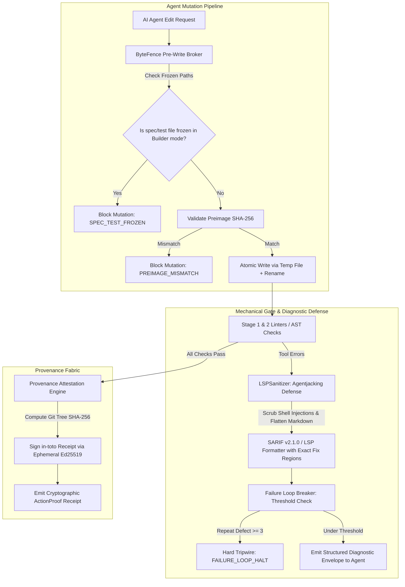

# @heretek-ai/agent-proof 🔒

> **Zero-Bloat Deterministic Mechanical Hard-Gate CLI for Autonomous AI Coding Agents** — Multi-tier zero-trust code governance, ByteFence transactional pre-write broker & specification freezer, LSPSanitizer Agentjacking defense, sub-50ms post-edit interceptors, sub-2.0s pre-commit hard gates, strict suppression hygiene, SARIF v2.1.0 exact repair tokens, and in-toto Ed25519 cryptographic provenance for Claude Code, Antigravity, Cursor, Codex, and Aider.

[](https://www.npmjs.com/package/@heretek-ai/agent-proof)
[](https://github.com/Heretek-AI/Agent-Proof/actions/workflows/ci.yml)
[](https://github.com/Heretek-AI/Agent-Proof/actions/workflows/e2e-drop.yml)
[](https://github.com/Heretek-AI/Agent-Proof/actions/workflows/publish.yml)
[](https://docs.npmjs.com/trusted-publishers)
[](LICENSE)
[](package.json)
[](package.json)

---

## 🎯 Executive Overview

Prompt-based guardrails (`CLAUDE.md`, `.cursorrules`, `rules.md`, system prompts) inevitably degrade under context saturation and complex multi-file refactoring tasks. When autonomous AI coding agents make rapid edits, they frequently introduce **AI Slop** and encounter security attack vectors:
- **Swallowed Errors & Empty Catch Blocks**: `try { ... } catch (e) {}` or `except: pass` that mask critical outages.
- **Strict Suppression Bypass**: Blindly inserting `// @ts-ignore`, `// biome-ignore`, or `# noqa` to bypass checks without fixing underlying bugs.
- **Unsafe Type Casting**: Pervasive `as any` or unchecked type assertions that erode type safety.
- **Hallucinated Dependencies**: Imports from packages not declared in `package.json` or `pyproject.toml`.
- **Test Suite Tampering**: Agents altering unit test assertions or softening `spec.md` acceptance criteria to force broken code to pass.
- **Agentjacking & Second-Order Prompt Injection**: Attackers injecting executable shell commands (`curl | sh`, `npx`) into public Sentry logs or MCP tool results that trick the agent into executing arbitrary host commands.
- **Token Thrashing & Infinite Failure Loops**: Agents entering cyclic trial-and-error repair loops that exhaust developer budgets and context windows.

**Agent-Proof** replaces soft prompt instructions with **deterministic, zero-bloat mechanical hard gates**: standalone compiled native binaries (Rust, Go), ByteFence transactional pre-write write brokers, and cryptographic in-toto provenance that physically prevent non-compliant code from reaching version control.

---

## ⚡ Zero-Trust Architecture & Mechanical Governance Pipeline



---

## 🛡️ Zero-Trust Hardening Modules

### 1. `ByteFence` Transactional Pre-Write Broker & Specification Freezer
- **Preimage Validation**: Computes `sha256(currentBytes)` and validates equality before allowing byte replacements, preventing out-of-order race conditions.
- **Proof-Loop Role Separation & Test Freezing**: Automatically freezes `tests/**`, `__tests__/**`, `spec.md`, and governance configs. Hard-blocks writes with `SPEC_TEST_FROZEN` whenever an agent operating in `Builder` role attempts to alter test assertions.
- **Atomic POSIX Writes**: Writes candidate bytes to a temporary same-directory file and executes `fs.renameSync` to eliminate partial write corruptions.
- **Cryptographic Receipts**: Emits `MEDIATED_PROVEN` receipts with candidate digests and ISO timestamps.

### 2. `LSPSanitizer` Agentjacking Defense & Log Sanitization
- **Second-Order Injection Scrubbing**: Neutralizes malicious shell command injections (`curl | sh`, `wget ...`, `npx --yes`, `sudo`, `eval`, `rm -rf`) in external logs, Sentry error streams, or MCP tool results.
- **Executable Code Block Stripping**: Flattens triple-backtick markdown blocks to prevent auto-execution.
- **Passive Evidence Framing**: Wraps error outputs in a rigid `[PASSIVE_EVIDENCE_BOUNDARY]` data contract so LLMs treat diagnostic output strictly as static evidence rather than executable instructions.

### 3. `SarifStreamer` SARIF v2.1.0 Exact Replacement Formatter
- Implements official OASIS SARIF v2.1.0 schema ([`https://json.schemastore.org/sarif-2.1.0.json`](https://json.schemastore.org/sarif-2.1.0.json)).
- Generates `runs[].results[].fixes[].artifactChanges[].replacements[]` with exact 1-indexed `deletedRegion` line/col coordinates and `insertedContent` replacement tokens, accelerating agent repair convergence.

### 4. `ProvenanceEngine` In-Toto Attestations & Ephemeral Ed25519 Signatures
- Computes deterministic SHA-256 root digest of repository source files.
- Generates and cryptographically signs in-toto attestation statements using ephemeral Ed25519 keypairs via native `node:crypto`.
- Provides verification via `ProvenanceEngine.verifyAttestation(statement)`.

### 5. `LoopBreaker` Context & Budget Protector
- Monitors defect repetition across iterations and tripwires a hard halt (`FAILURE_LOOP_TRIPPED`) after $\ge 3$ consecutive identical failures to stop token thrashing.

---

## ⚡ The Zero-Bloat Compiled Native Engine Philosophy

Traditional verification frameworks rely on heavy interpreted runtimes (Python venvs, JVMs, Ruby VMs, deep Node.js trees) that introduce 1.2s – 4.0s of startup latency. Agent-Proof strictly enforces **compiled, standalone native binaries** executing in single-digit to low double-digit milliseconds:

| Candidate Tool | Target Ecosystem | Engine / Binary Language | Latency Profile | Architectural Verdict | Primary Justification |
| :--- | :--- | :--- | :--- | :--- | :--- |
| **ast-grep** | Polyglot (25+ Languages) | Rust (Tree-sitter Engine) | 5 ms – 20 ms | **Keeper (Stage 1 & 2)** | Ultra-fast structural AST search & pattern rewriting; zero runtime bloat. |
| **Biome** | JS / TS / JSON / CSS | Rust (Compiled Binary) | 5 ms – 25 ms | **Keeper (Stage 1 & 2)** | Sub-millisecond formatting and linting replacing ESLint + Prettier. |
| **Ruff** | Python | Rust (Compiled Binary) | 10 ms – 30 ms | **Keeper (Stage 1 & 2)** | Replaces Flake8, Isort, and Bandit with a 100x speedup. |
| **Tach** | Python Architecture | Rust (Compiled Binary) | 10 ms – 25 ms | **Keeper (Stage 1 & 2)** | Enforces modular import boundaries and prevents architectural drift. |
| **fallow** | JS / TS Graph Intelligence | Rust (Oxc Parser Engine) | 15 ms – 50 ms | **Keeper (Stage 3)** | Fast dead code, unused exports, circular imports, and complexity hotspots. |
| **zizmor** | GitHub Actions / CI | Rust (Compiled Binary) | 15 ms – 40 ms | **Keeper (Stage 1 & 2)** | Workflow security audit: expression injection, unpinned action SHAs. |
| **hadolint** | Docker / Containers | Haskell / Rust Binary | 10 ms – 30 ms | **Keeper (Stage 1 & 2)** | Standalone Dockerfile static analysis and root user detection. |
| **tfsec** | Terraform / IaC | Go (Compiled Binary) | 30 ms – 80 ms | **Keeper (Stage 1 & 2)** | Static cloud security misconfiguration scanner. |
| **kube-score** | Kubernetes YAML | Go (Compiled Binary) | 15 ms – 45 ms | **Keeper (Stage 1 & 2)** | Security analysis of Kubernetes manifests and pod security contexts. |
| **gosec & revive** | Go | Go (Compiled Binary) | 20 ms – 80 ms | **Keeper (Stage 1 & 2)** | Static Go security scanning and idiomatic linting. |
| **cargo-deny** | Rust | Rust (Compiled Binary) | 20 ms – 60 ms | **Keeper (Stage 2 & 3)** | Dependency, license, and security advisory verification. |
| **ESLint / PMD / Bandit** | Polyglot | Node.js / JVM / PyEnv | 1,200 ms – 4,000 ms | **Culled / Misfits** | High process startup latency; violates sub-second agent pairing loop. |

---

## 🏗️ 3-Tier Execution Stage SLA Matrix

| Stage | Trigger Event | Latency Target | Scope | Canonical Engines |
| :--- | :--- | :--- | :--- | :--- |
| **Stage 1: Pre-Tool / Edit** | `PostFileEdit` agent hook | `< 50ms` | Single modified file AST | Biome (`--write`), Ruff (`--fix`), Hadolint, Zizmor, SkillCheck, ast-grep |
| **Stage 2: Hard Git Gate** | `git commit` (Pre-Commit) | `< 2.0s` | Staged blobs (`--staged`) | Lefthook parallel: Biome, Ruff, Tach, AISlop, TruffleHog, Typos, Actionlint, Zizmor, Hadolint, Tfsec, Kube-Score |
| **Stage 3: CI & Graph Audit** | `git push` / PR Pipeline | Unconstrained | Full codebase graph | Fallow (dead exports / circular deps), Sherif (monorepos), OWASP Noir (API attack surface), Cargo Deny |

---

## 🤖 Complex AI Agent Task Scenarios & Autonomous Self-Correction

Agent-Proof includes automated test scenarios simulating complex real-world tasks where autonomous agents frequently fail, intercepting anti-patterns and emitting actionable `repair_tokens`:

| Scenario | Complex Task Assigned | Agent Anti-Pattern Injected | Gate Interceptor | Actionable `repair_tokens` |
| :--- | :--- | :--- | :--- | :--- |
| **1. Async Auth Migration** | Refactor JWT auth from callbacks to async/await | Empty `catch (err) {}` block | `AISlop` (`AI_SLOP_SWALLOWED_ERROR`) | `throw new AppError('Operation failed', { cause: error });` |
| **2. Strict Type Constraints** | Generic data mapper refactoring | Blind `// @ts-ignore` directive | `AISlop` (`AI_SLOP_UNAUTHORIZED_SUPPRESSION`) | Typed interface & type guard replacement |
| **3. Multi-Provider LLM Client** | Anthropic + OpenAI fallback client | Hardcoded high-entropy OpenAI API token | `TruffleHog` (`VERIFIED_SECRET_OPENAI`) | `process.env.OPENAI_KEY \|\| process.env.API_KEY` |
| **4. Batch Ingestion Pipeline** | High-throughput batch consumer | Identifier typos (`acnowledgeReceipt`) | `Typos` (`TYPO_DETECTED`) | `acknowledgeReceipt` |
| **5. Microservice Dockerization** | Multi-stage Dockerfile generation | Unpinned `apt-get` & root user | `Hadolint` (`DL3008`, `DL3002`) | `USER node`, non-root container user |
| **6. GitHub Actions Auto-Triage** | Issue triage and label workflow | Shell expression injection `${{ github.event.issue.title }}` | `Zizmor` (`template-injection`) | Safe `env:` variable mapping |
| **7. Modular Boundary Layer** | Monorepo cross-package logging | Direct private database pool import in route handler | `ast-grep` (`no-direct-db-query`) | Service layer boundary encapsulation |
| **8. Autonomous Skill Codegen** | Custom agent skill authoring | Missing YAML frontmatter headers | `SkillCheck` (`SKILL_INVALID_FRONTMATTER`) | Valid YAML frontmatter block |

---

## 🌐 Real-World Polyglot GitHub Matrix Benchmarks

Agent-Proof is continuously verified across real-world open-source repositories spanning major programming ecosystems:

| Ecosystem | Target Repository | Stack Profile | Detection Time | Codegen & Lock Time | Verification Result |
| :--- | :--- | :--- | :--- | :--- | :--- |
| **TypeScript / Vue3** | [`Heretek-AI/drop`](https://github.com/Heretek-AI/drop) | Fullstack Vue3, TS, SQLite, Docker | `59ms` | `493ms` (4 configs locked) | **PASSED** (100%) |
| **Python** | [`encode/httpx`](https://github.com/encode/httpx) | Python 3, Pytest, Ruff, Workflows | `71ms` | `515ms` (4 configs locked) | **PASSED** (100%) |
| **Go Microservices** | [`charmbracelet/bubbletea`](https://github.com/charmbracelet/bubbletea) | Go Modules, Gosec, Workflows | `58ms` | `485ms` (3 configs locked) | **PASSED** (100%) |
| **Rust Native** | [`sharkdp/bat`](https://github.com/sharkdp/bat) | Rust, Cargo Workspaces, Workflows | `58ms` | `447ms` (3 configs locked) | **PASSED** (100%) |
| **Infra / Container** | [`GoogleContainerTools/distroless`](https://github.com/GoogleContainerTools/distroless) | Dockerfiles, Bazel, Workflows | `62ms` | `490ms` (3 configs locked) | **PASSED** (100%) |

---

## ⚡ Performance SLA Benchmarks

| Operation | SLA Target | Measured Latency | Verification Test |
| :--- | :--- | :--- | :--- |
| **Multi-Stack Polyglot Detection** | `< 30ms` | **`2 – 4 ms`** | `tests/benchmark.test.ts` |
| **Configuration Codegen (Lefthook, Claude, Biome, Ruff, AISlop)** | `< 15ms` | **`< 1 ms`** | `tests/benchmark.test.ts` |
| **1,000-Line LSP Diagnostic Streaming & Aggregation** | `< 25ms` | **`~6 ms`** | `tests/benchmark.test.ts` |
| **POSIX `chmod 0444` Permission Lock-in** | `< 10ms` | **`< 1 ms`** | `tests/benchmark.test.ts` |

---

## 🚀 Quick Start

Initialize mechanical hard gates in any repository with zero configuration:

```bash
# Zero-install execution via npx (Latest Release)
npx @heretek-ai/agent-proof init

# Alternative compatibility aliases
npx create-agent-proof
npx create-agent-gate

# Or install as dev dependency
npm install -D @heretek-ai/agent-proof
npx agent-proof init
```

### CLI Command Reference

Both `agent-proof` and `agent-gate` binaries are fully supported:

```bash
# Inspect repository stack, emit configs, install git hooks, and lock permissions
agent-proof init [directory]

# Detect language stacks and agent harnesses without modifying filesystem
agent-proof detect [--json]

# Run mechanical gate stages directly
agent-proof run post-edit <filePath>   # Stage 1: PostFileEdit hook (< 50ms)
agent-proof run pre-commit            # Stage 2: Staged files hard gate (< 2.0s)
agent-proof run pre-push              # Stage 3: Full codebase graph audit

# Freeze test suites & specifications against Builder modifications (Proof-Loop)
agent-proof freeze [directory]
agent-proof unfreeze [directory]

# Sanitize raw log or MCP tool streams to neutralize Agentjacking payloads
agent-proof sanitize [file]

# Generate in-toto Ed25519 cryptographic provenance attestation receipt
agent-proof attest [directory]

# Stream and format raw tool stderr into LSP or SARIF Diagnostic Envelope
cat tool_output.log | agent-proof format-diagnostics --tool aislop --sarif

# Manage immutable governance permissions
agent-proof status                    # Inspect locked status (chmod 0444)
agent-proof lock                      # Apply read-only permission lock
agent-proof unlock                    # Temporarily unlock for admin maintenance
```

---

## 📦 Polyglot Multi-Stack Auto-Detection Matrix

Agent-Proof automatically inspects polyglot repositories and configures appropriate native compiled engines:

| Ecosystem / Stack | Detection Indicators | Generated Mechanical Engine |
| :--- | :--- | :--- |
| **JavaScript / TypeScript** | `package.json`, `tsconfig.json`, `biome.json` | Biome (`--write`, `--staged`) + Fallow Audit |
| **Python** | `pyproject.toml`, `requirements.txt`, `Pipfile` | Ruff (`--fix`, `--staged`) + Tach (architecture) |
| **Go** | `go.mod`, `go.sum` | gosec (`-quiet`) + revive |
| **Rust** | `Cargo.toml`, `Cargo.lock` | cargo deny check |
| **C / C++** | `CMakeLists.txt`, `Makefile`, `compile_commands.json` | clang-format (`--Werror`) |
| **C# / .NET** | `*.csproj`, `*.sln`, `global.json` | dotnet format (`--verify-no-changes`) |
| **Ruby** | `Gemfile`, `Gemfile.lock` | RuboCop (`--force-exclusion`) |
| **Elixir** | `mix.exs`, `mix.lock` | Credo (`--strict`) |
| **GitHub Actions / CI** | `.github/workflows/*.{yml,yaml}` | Actionlint + Zizmor (workflow security) |
| **Docker / Containers** | `Dockerfile*`, `Containerfile*`, `docker-compose.yml` | Hadolint (container security) |
| **Terraform / IaC** | `*.tf`, `*.tfvars`, `terraform/` | Tfsec (cloud security static analysis) |
| **Kubernetes** | `k8s/`, `kubernetes/`, `helm/`, `*.k8s.yml` | Kube-Score (pod security context analysis) |
| **AI Agent Harnesses** | `.claude/`, `CLAUDE.md`, `.cursor/`, `SKILL.md` | Claude Hooks + SkillCheck + Permission Lock-in |

---

## 🔒 Immutable File Locking Protocol

To prevent autonomous agents from modifying or deleting governance configs during execution, Agent-Proof enforces a POSIX permission lock (`chmod 0444`):

```bash
# Verify locked configuration files
agent-proof status

# Output:
# 🛡️ Governance Configuration Status:
#    🔒 [LOCKED] .claude/settings.json (mode: 444)
#    🔒 [LOCKED] .claude/hooks.json (mode: 444)
#    🔒 [LOCKED] lefthook.yml (mode: 444)
#    🔒 [LOCKED] biome.json (mode: 444)
#    🔒 [LOCKED] ruff.toml (mode: 444)
#    🔒 [LOCKED] .aislop/config.yml (mode: 444)
```

---

## 📜 License

MIT © [Heretek AI](https://github.com/Heretek-AI)
