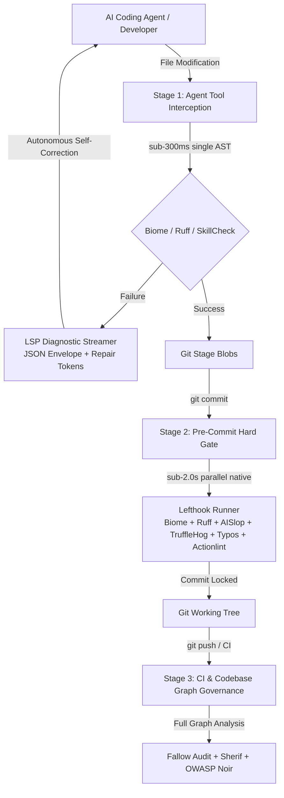

# @heretek-ai/agent-proof 🔒

> **Mechanical Hard-Gate for AI Coding Agents** — Zero-dependency architecture for deterministic AI code governance and sub-second pre-commit gates.

[](https://www.npmjs.com/package/@heretek-ai/agent-proof)
[](LICENSE)

---

## 🎯 Executive Overview

Prompt-based guardrails (`CLAUDE.md`, `.cursorrules`, `rules.md`) fail under context pressure. When autonomous AI coding agents (Claude Code, Cursor, Codex, Devin, Aider) execute tasks, they frequently produce **AI Slop**:
- Empty catch blocks and swallowed errors
- Hallucinated or phantom dependencies
- Unsafe type casting (`as any`)
- Architectural boundary drift and circular imports

**Agent-Proof** replaces fragile prompt instructions with **deterministic, multi-tier mechanical hard gates**: native binaries and lifecycle hooks that physically intercept agent tool calls and git operations before non-compliant code can reach version control.

---

## 🏗️ Architecture & Multi-Tier Execution Harness



### The 3 Execution Stages

| Stage | Trigger Event | Runtime Budget | Scope | Enforced Canonical Engines |
| :--- | :--- | :--- | :--- | :--- |
| **Stage 1: Agent Interception** | `PostFileEdit` / Tool hook | `< 300ms` | Single modified file AST | Biome (`--write`), Ruff (`--fix`), SkillCheck |
| **Stage 2: Pre-Commit Hard Gate** | `git commit` (Pre-Commit) | `< 2.0s` | Staged git blobs (`--staged`) | Lefthook parallel: Biome, Ruff, AISlop, TruffleHog, Typos, Actionlint |
| **Stage 3: CI & Graph Governance** | `git push` / CI Pipeline | Unconstrained | Full Codebase Graph | Fallow (dead code / arch drift), Sherif (monorepo), OWASP Noir (API attack surface) |

---

## 🚀 Quick Start

Initialize mechanical hard gates in any repository with zero configuration:

```bash
# Via npx (zero-install)
npx @heretek-ai/agent-proof init
# or
npx create-agent-proof
# or
npx create-agent-gate

# Or install globally / locally
npm install -g @heretek-ai/agent-proof
agent-proof init
```

### CLI Commands

Both `agent-proof` and `agent-gate` can be used interchangeably:

```bash
# Run multi-stack inspection and emit configurations
agent-proof init [directory]

# Detect language stacks and agent harnesses
agent-proof detect [--json]

# Run synchronous gates
agent-proof run pre-commit
agent-proof run pre-push
agent-proof run post-edit <filePath>

# Format raw tool stderr into LSP Diagnostic Envelope
cat tool_output.log | agent-proof format-diagnostics --tool aislop

# Manage immutable governance permissions
agent-proof lock
agent-proof unlock
agent-proof status
```

---

## 📦 Multi-Stack Auto-Detection Matrix

Agent-Proof automatically inspects and configures native engines for:

- **JavaScript / TypeScript:** `package.json`, `tsconfig.json`, `biome.json`, `pnpm-workspace.yaml`
- **Python:** `pyproject.toml`, `requirements.txt`, `Pipfile`, `ruff.toml`
- **Go:** `go.mod`, `go.sum`
- **Rust:** `Cargo.toml`, `Cargo.lock`
- **Infra & Workflows:** `.github/workflows/*.yml`, `Dockerfile`, `docker-compose.yml`
- **Agent Harnesses:** `.claude/`, `.cursor/`, `AGENTS.md`, `SKILL.md`, `.claude/skills/*.md`

---

## 📡 LSP Diagnostic Streamer & Repair Tokens Protocol

When a mechanical gate fails during an agent session, Agent-Proof converts raw terminal stderr into an **LSP-compliant JSON Diagnostic Envelope** enriched with concrete **`repair_tokens`** to enable autonomous self-correction loops:

```json
{
  "$schema": "https://json.schemastore.org/lsif.json",
  "version": "1.0.0",
  "status": "GATE_FAILED",
  "summary": {
    "total_errors": 1,
    "total_warnings": 0,
    "gate_stage": "PreCommit"
  },
  "diagnostics": [
    {
      "source": "aislop",
      "rule_id": "AI_SLOP_SWALLOWED_ERROR",
      "severity": "ERROR",
      "file_path": "src/controllers/auth.ts",
      "range": {
        "start": { "line": 88, "column": 7 },
        "end": { "line": 92, "column": 8 }
      },
      "code_snippet": "try {\n  await verifyToken(token);\n} catch (e) {}",
      "error_message": "AI-Slop Pattern Detected: Empty catch block silently suppresses authentication failure.",
      "repair_instruction": {
        "action": "REWRITE_BLOCK",
        "description": "Handle the exception explicitly. Either log the error, rethrow a custom AuthError, or return an explicit HTTP 401 Unauthorized response.",
        "repair_tokens": [
          "import { AuthException } from '../errors';",
          "throw new AuthException('Token verification failed', { cause: e });"
        ]
      }
    }
  ]
}
```

---

## ⚡ Zero-Dependency Binary Packaging

`@heretek-ai/agent-proof` packages platform-specific native binaries using NPM `optionalDependencies` matrix pinning:
- Darwin (macOS): `darwin-arm64`, `darwin-x64`
- Linux: `linux-arm64`, `linux-x64`
- Windows: `win32-arm64`, `win32-x64`

`bin/agent-proof.js` / `bin/agent-gate.js` directly delegates execution to the native binary via `execFileSync` without invoking npm or external interpreters (Python/Rust/Go).

---

## 🛡️ Mechanical Gate Lock-in

To prevent autonomous agents from modifying governance rules or removing constraints, Agent-Proof applies immutable filesystem permissions (`chmod 0444`) to:
- `.claude/settings.json`
- `.claude/hooks.json`
- `lefthook.yml`
- `biome.json`
- `ruff.toml`
- `.aislop/config.yml`

---

## 🧪 Testing

```bash
# Run unit & integration test suites
npm test

# Run type checks
npm run typecheck

# Build bundle
npm run build
```

## 📄 License

MIT © [Heretek-AI](https://github.com/Heretek-AI)
