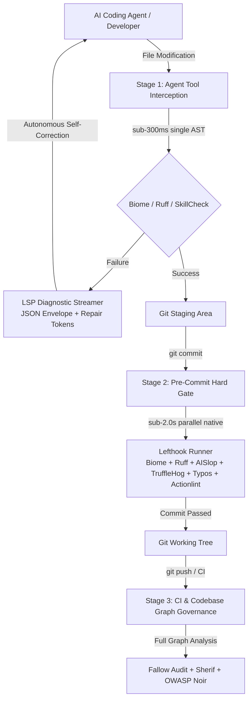

# @heretek-ai/agent-proof 🔒

> **Mechanical Hard-Gate for Autonomous AI Coding Agents** — Zero-dependency multi-tier code governance, sub-second post-edit interceptors, pre-commit gates, and LSP diagnostic envelopes for Claude Code, Antigravity, Cursor, Codex, and Aider.

[](https://www.npmjs.com/package/@heretek-ai/agent-proof)
[](https://github.com/Heretek-AI/Agent-Proof/actions/workflows/ci.yml)
[](https://github.com/Heretek-AI/Agent-Proof/actions/workflows/e2e-drop.yml)
[](https://github.com/Heretek-AI/Agent-Proof/actions/workflows/publish.yml)
[](https://docs.npmjs.com/trusted-publishers)
[](LICENSE)
[](package.json)
[](package.json)

---

## 🎯 Executive Overview

Prompt-based guardrails (`CLAUDE.md`, `.cursorrules`, `rules.md`) inevitably degrade under context saturation. When autonomous AI coding agents execute multi-file refactors, they frequently introduce **AI Slop**:
- **Swallowed Errors**: Empty catch blocks (`try { ... } catch (e) {}`) that mask production outages.
- **Unsafe Type Casting**: `as any` or unchecked type assertions that bypass type safety.
- **Hallucinated Dependencies**: Imports from packages not declared in `package.json` or `pyproject.toml`.
- **Architectural Drift**: Tight coupling, circular imports, or unauthorized file modifications.
- **Governance Tampering**: Agents weakening or deleting lint configs to bypass validation.

**Agent-Proof** replaces soft prompt instructions with **deterministic, multi-tier mechanical hard gates**: native binary pipelines and lifecycle interceptors that physically prevent non-compliant code from reaching version control.

---

## 🏗️ 3-Tier Execution Architecture



### Execution Stage SLA Matrix

| Stage | Trigger Event | Latency Target | Scope | Canonical Engines |
| :--- | :--- | :--- | :--- | :--- |
| **Stage 1: Pre-Tool / Edit** | `PostFileEdit` agent hook | `< 300ms` | Single modified file AST | Biome (`--write`), Ruff (`--fix`), SkillCheck |
| **Stage 2: Hard Git Gate** | `git commit` (Pre-Commit) | `< 2.0s` | Staged blobs (`--staged`) | Lefthook parallel: Biome, Ruff, AISlop, TruffleHog, Typos, Actionlint |
| **Stage 3: CI & Graph Audit** | `git push` / PR Pipeline | Unconstrained | Full codebase graph | Fallow (dead code / arch drift), Sherif (monorepo), OWASP Noir (API surface) |

---

## 🚀 Quick Start

Initialize mechanical hard gates in any repository with zero configuration:

```bash
# Zero-install execution via npx
npx @heretek-ai/agent-proof init

# Alternative compatibility aliases
npx create-agent-proof
npx create-agent-gate

# Or install globally / locally
npm install -D @heretek-ai/agent-proof
npx agent-proof init
```

### CLI Command Reference

Both `agent-proof` and `agent-gate` binaries are fully supported:

```bash
# Inspect repository stack, emit configs, install git hooks, and lock permissions
agent-proof init [directory]

# Detect language stacks and agent harnesses without modifying filesystem
agent-proof detect [--json]

# Run mechanical gate stages directly
agent-proof run post-edit <filePath>   # Stage 1: PostFileEdit hook (< 300ms)
agent-proof run pre-commit            # Stage 2: Staged files hard gate (< 2.0s)
agent-proof run pre-push              # Stage 3: Full codebase graph audit

# Stream and format raw tool stderr into LSP Diagnostic Envelope
cat tool_output.log | agent-proof format-diagnostics --tool aislop

# Manage immutable governance permissions
agent-proof status                    # Inspect locked status (chmod 0444)
agent-proof lock                      # Apply read-only permission lock
agent-proof unlock                    # Temporarily unlock for admin maintenance
```

---

## 📦 Polyglot Multi-Stack Auto-Detection

Agent-Proof automatically inspects the target repository and tailors sub-second native check pipelines across polyglot ecosystems:

| Ecosystem | Detected Project Markers | Enforced Hard-Gate Engines |
| :--- | :--- | :--- |
| **JavaScript / TypeScript** | `package.json`, `tsconfig.json`, `pnpm-workspace.yaml`, `biome.json` | **Biome** (Formatting & Linting), **AISlop** (Anti-patterns) |
| **Python** | `pyproject.toml`, `requirements.txt`, `Pipfile`, `ruff.toml` | **Ruff** (AST Linting & Auto-fix), **AISlop** |
| **Go** | `go.mod`, `go.sum` | **Gosec** (Static Security Analysis) |
| **Rust** | `Cargo.toml`, `Cargo.lock` | **Cargo Deny** (Dependency, License & Advisory Gate) |
| **C / C++** | `CMakeLists.txt`, `Makefile`, `compile_commands.json` | **Clang-Format**, **Clang-Tidy** |
| **C# / .NET** | `*.csproj`, `*.sln`, `global.json` | **Dotnet Format** |
| **Java** | `pom.xml`, `build.gradle`, `build.gradle.kts` | **Checkstyle**, **SpotBugs** |
| **Ruby** | `Gemfile`, `.rubocop.yml` | **Rubocop** |
| **Elixir** | `mix.exs` | **Mix Credo** |
| **Infrastructure & CI** | `.github/workflows/*.yml`, `Dockerfile` | **Actionlint**, **TruffleHog**, **Typos** |
| **Agent Harnesses** | `.claude/`, `.cursor/`, `AGENTS.md`, `CLAUDE.md`, `GEMINI.md` | **Hook Interceptors** (`PostFileEdit`, `PreCommit`) |

---

## 📡 LSP Diagnostic Streamer & Autonomous Repair Tokens

When a mechanical gate intercepts an issue, Agent-Proof converts raw terminal output into an **LSP Diagnostic Envelope** (`https://json.schemastore.org/lsif.json`) containing actionable **`repair_tokens`** so autonomous agents can self-correct deterministically:

```json
{
  "$schema": "https://json.schemastore.org/lsif.json",
  "version": "1.0.0",
  "status": "GATE_FAILED",
  "summary": {
    "total_errors": 1,
    "total_warnings": 0,
    "gate_stage": "PreCommit"
  },
  "diagnostics": [
    {
      "source": "aislop",
      "rule_id": "AI_SLOP_SWALLOWED_ERROR",
      "severity": "ERROR",
      "file_path": "server/utils/auth.ts",
      "range": {
        "start": { "line": 42, "column": 5 },
        "end": { "line": 46, "column": 6 }
      },
      "code_snippet": "try {\n  await verifySession(token);\n} catch (e) {}",
      "error_message": "AI-Slop Pattern Detected: Empty catch block silently suppresses authentication failure.",
      "repair_instruction": {
        "action": "REWRITE_BLOCK",
        "description": "Handle the exception explicitly. Either log the error, rethrow with cause, or return an explicit failure result.",
        "repair_tokens": [
          "throw new AuthException('Session verification failed', { cause: e });"
        ]
      }
    }
  ]
}
```

---

## 🛡️ Immutable Governance Permission Lock-In

To prevent AI coding agents from modifying governance rules, weakening linter settings, or disabling hooks, Agent-Proof applies immutable filesystem permissions (`chmod 0444` / read-only) to:

- `.claude/settings.json`
- `.claude/hooks.json`
- `lefthook.yml`
- `biome.json`
- `ruff.toml`
- `.aislop/config.yml`

Any direct file write attempt by an agent fails immediately with `EACCES (Permission Denied)`.

---

## 🧪 Real-World E2E Test Suite (`Heretek-AI/drop`)

Agent-Proof is continuously validated against real-world production codebases. The automated E2E test suite:
1. Clones [`Heretek-AI/drop`](https://github.com/Heretek-AI/drop) (a full-stack Nuxt/Vue/TypeScript & Nitro game distribution platform).
2. Initializes `@heretek-ai/agent-proof` and locks governance controls.
3. Fetches live open issues from [`Drop-OSS/drop`](https://github.com/Drop-OSS/drop/issues).
4. Drives Claude Code under active mechanical gate interception using organization LLM endpoints.
5. Verifies sub-second `PostFileEdit` formatting and sub-2.0s pre-commit validation.

```bash
# Run real-world E2E test suite locally
npm run test:e2e-drop

# Run sandbox lifecycle validation
npm run test:real-repo

# Run full Vitest test suite
npm test
```

---

## 🤖 Multi-Agent Ecosystem Compatibility

Agent-Proof integrates out of the box with all leading AI coding assistants and autonomous agents:

- **Claude Code (`claude`)**: Direct lifecycle hook integration via `.claude/hooks.json` (`PostFileEdit` & `PreCommit`).
- **Google Gemini & Antigravity**: Seamless paired programming workflow with `GEMINI.md` and MCP server integration.
- **Cursor / Windsurf**: Parallel pre-commit hard gates and background diagnostics.
- **Aider / Codex / Devin**: Sub-second pre-commit git gates preventing invalid commits before PR creation.

---

## 🔒 Security & Supply Chain Integrity

- **Zero Runtime Dependencies**: Core CLI bundle compiles down to zero third-party dependencies.
- **Trusted Publishing (OIDC)**: Published to npm via GitHub Actions OIDC Trusted Publishing with cryptographic Sigstore provenance.
- **TOCTOU Safe**: Atomic file write flags (`wx`/`w`) preventing filesystem race conditions.

---

## 📄 License

MIT © [Heretek-AI](https://github.com/Heretek-AI)
